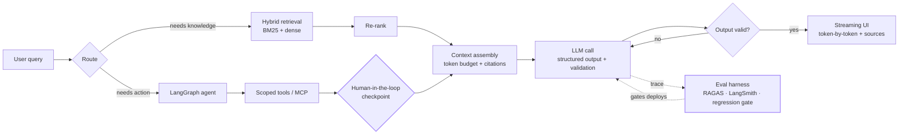

**Syket Bhattachergee** · Chattogram, Bangladesh 🇧🇩

`🟢 Open to AI Engineer roles — remote or relocation`

---

## What I do

I build **LLM systems that hold up in production** — RAG pipelines with real retrieval strategy, agents as explicit state machines, and MCP servers that expose scoped tools to Claude and other clients.

Software engineer since 2020. AI engineer since 2025. **The pivot wasn't a restart.** Everything that makes an LLM feature survive contact with real users — state, latency, retries, error handling, knowing what to do when a call fails — is the same engineering I've been doing for five years. The model is just a new dependency, and it's the least reliable one in the stack.

That's why I lead with evals. I'd rather prove a change improved the system than guess.

---

## How I think about an AI system

The two boxes most demos skip are the two I care about most: **the eval gate** and **the human checkpoint**.

---

## Featured work

> Replace these with your real repos — one line on *what it does*, one on *what it proves*, one *measured number*.

| Project | What it is | The engineering signal |
|---|---|---|
| **[rag-eval-harness](#)** | Golden-set + LLM-judge harness with a CI regression gate | Compares 2 chunking strategies × 2 embedding models; faithfulness ↑ from `__%` to `__%` |
| **[langgraph-support-agent](#)** | Multi-step support agent — lookups, refunds, escalation | Supervisor + parallel sub-agents, HIL approval before any write action |
| **[mcp-toolkit](#)** | MCP server exposing scoped internal tools to Claude | Per-tool auth scoping, structured errors, replaces `__` bespoke integrations |
| **[stream-ui-kit](#)** | Generative UI rendered from tool calls (Vercel AI SDK + RSC) | Token-by-token streaming, optimistic updates, inline citation UX |

📌 *Pinned repos are ordered by relevance, not stars.*

---

## Evaluation & observability

Because a demo that works once isn't evidence.

**RAGAS** (faithfulness · answer relevance · context precision) · **LangSmith** tracing & dataset curation · **Langfuse** / **Braintrust** harnesses · **promptfoo** for prompt regression in CI · planted-failure datasets · retrieval precision/recall @ k

---

## Stack

**AI / LLM**
`Python` `LangChain` `LangGraph` `LangSmith` `LlamaIndex` `Pydantic` `FastAPI` `MCP` `RAGAS`
`OpenAI` · `Anthropic Claude` · `Gemini` · `Hugging Face`
`Pinecone` `Qdrant` `ChromaDB` `pgvector`

**Product surface**
`TypeScript` `Next.js` `React` `React Native` `Expo` `Vercel AI SDK` `Tailwind` `GraphQL`

**Infra**
`Docker` `PostgreSQL` `Prisma` `Redis` `Vercel` `GitHub Actions`

<b>What each area means in practice →</b>

 

| Area | In practice |
|---|---|
| 🔍 **RAG** | Chunking strategy selection, hybrid BM25 + dense search, cross-encoder re-ranking, metadata filters, citation UX |
| 🤖 **Agents** | LangGraph state machines, tool-use, supervisor handoffs, parallel sub-agents, human-in-the-loop checkpoints |
| 🧩 **Context engineering** | Token budgeting, memory strategies, context-window management, prompt caching, model routing for cost |
| 📊 **Evals** | Golden sets, LLM-as-judge, regression gates in CI, tracing production failures back into the dataset |
| 🔌 **MCP** | Scoped, secure tool servers for Claude and other clients |
| 💬 **Streaming UI** | Vercel AI SDK, RSC, generative UI from tool calls, optimistic updates, graceful failure states |

---

## Shipped (before the AI work, and during)

**CreoWis Technologies** — Associate Software Engineer · *Jan 2024 – Present*
Built Finanion, a personal finance dashboard. Built a centralized auth system with RBAC (Keycloak-style). Built a JSON→PDF report generation pipeline. Shipped `next-i18n-test-automation` — **30% faster** than writing multi-language test coverage from scratch.

**Woofmeets** — SDE II · *Jan 2022 – Dec 2023*
Led frontend from zero on a pet services platform. Booking system for holistic health that lifted booking rate **15%**. Real-time customer↔vet chat on Socket.io. Introduced a self-review practice that cut bugs **10%**.

**LetsDunch** — Frontend Engineer · *Feb 2020 – Dec 2023*
Led 2 juniors building a mentorship collaboration platform. Rebuilt mentor search + time-slot booking, **+8% conversion**.

🎓 B.Sc. Computer Engineering — Port City International University

---

## Currently going deeper on

- 🧪 **Eval harnesses** — Langfuse, Braintrust, custom LLM-judge pipelines with regression gates
- 🕸 **Multi-agent orchestration** — supervisors, handoffs, parallel agents, durable execution
- 🎨 **Generative UI** — streaming React components straight out of tool calls
- 🔭 **On-device inference** — small models via WebGPU + Transformers.js

---

## Writing & sharing

I post regularly on **LinkedIn** about shipping LLM features — retrieval that actually retrieves, agents that fail safely, and the eval work nobody puts in the demo. The parts that break, not the happy path.

---

## Let's talk

If you're building with LLMs — RAG that has to be accurate, agents that have to be safe, or evals you don't have yet — I'm interested.

 

*Anyone can get an LLM to answer. The job is knowing whether the answer was right.*

